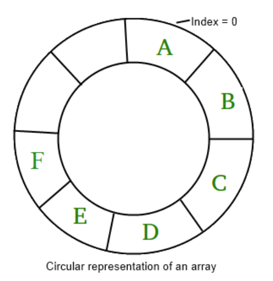
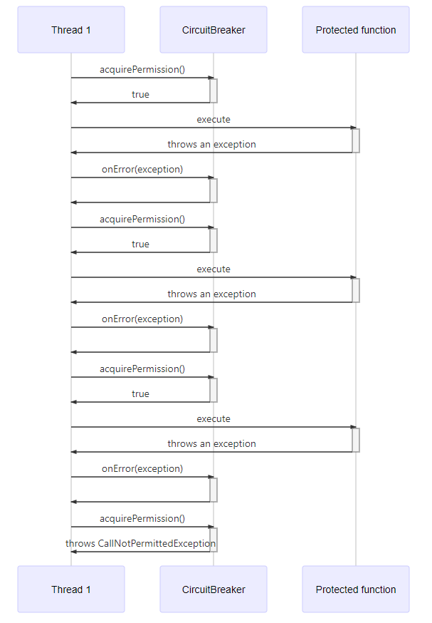
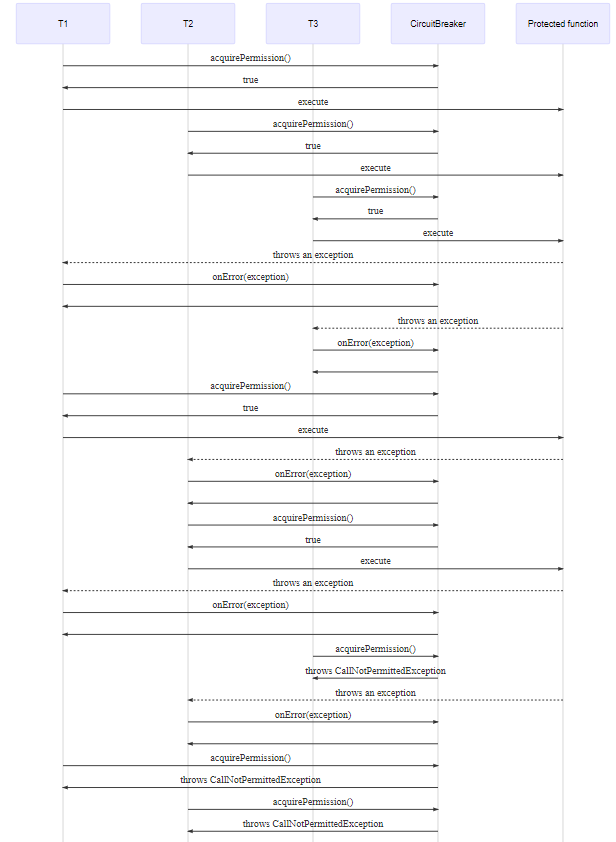
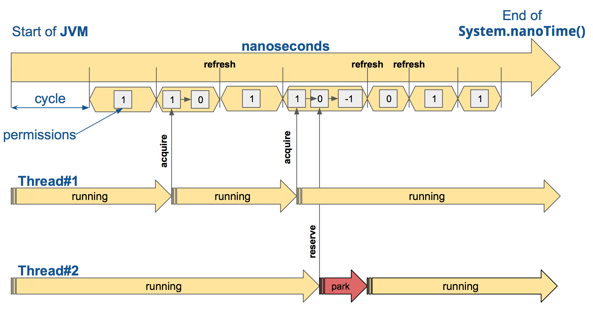
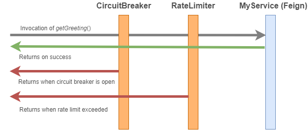

# resilience4j

- reference
    - https://resilience4j.readme.io/v1.7.0/docs/getting-started
    - https://oliveyoung.tech/blog/2023-08-31/circuitbreaker-inventory-squad/
- version : 1.7.0

---

- GETTING STARTED
    - Introduction
    - Comparison to Netflix Hystrix
    - Gradle
- CORE MODULES
    - CircuitBreaker
    - Bulkhead
    - RateLimiter
    - Retry
    - TimeLimiter
    - Cache
- ADD-ON MODULES
    - Kotlin
    - Feign
- SPRING REACTOR
    - Getting Started
    - Examples
- SPRING BOOT 2

---

# Getting Started

## Introduction

- Resilience4j 는 경량 fault tolerance 라이브러리 (inspired by Netflix Hystrix)
- Java 8, functional programming 위해 설계
- Netfilx Hystrix는 Archauis에 컴파일 의존성을 가지지만, Resilience4j는 Vavr 라이브러리만을 사용 (Vavr은 다른 라이브러리에 의존성이 없음)
    - Archauis는 Guaava, Apache Commons에 의존

### Sneak preview

- CircuitBreaker와 Retry를 람다 표현식으로 구현한 예제
- 예외 발생 시 3번 retry (재시도)
- retry 인터벌 설정 가능
- backoff strategy 설정 가능

```java
// default 설정으로 CircuitBreaker 생성
CircuitBreaker circuitBreaker = CircuitBreaker
        .ofDefaults("backendService");

// default 설정으로 Retry 생성
// 3번 retry 시도, 500ms 간격
Retry retry = Retry.ofDefaults("backendService");

// default 설정으로 Bulkhead 생성
Bulkhead bulkhead = Bulkhead.ofDefaults("backendService");

Supplier<String> supplier = () -> backendService
        .doSomething(param1, param2);

// circuitBreaker, retry, bulkhead를 doSomething에 적용
Supplier<String> decoratedSupplier = Decorators.ofSupplier(supplier)
        .withCircuitBreaker(circuitBreaker)
        .withBulkhead(bulkhead)
        .withRetry(retry)
        .decorate();

// supplier를 실행하고 예외로부터 복구 (람다)
String result = Try.ofSupplier(decoratedSupplier)
        .recover(throwable -> "Hello from Recovery").get();

// 람다 데코레이트 안하고 서킷 브레이커만 적용
String result = circuitBreaker.executeSupplier(backendService::doSomething);

// ThreadPoolBulkhead 에서 supplier 비동기로 실행
ThreadPoolBulkhead threadPoolBulkhead = ThreadPoolBulkhead.ofDefaults("backendService");

// CompletableFuture에 타임아웃 설정 
ScheduledExecutorService scheduledExecutorService = Executors.newScheduledThreadPool(3);
TimeLimiter timeLimiter = TimeLimiter.of(Duration.ofSeconds(1));

CompletableFuture<String> future = Decorators.ofSupplier(supplier)
        .withThreadPoolBulkhead(threadPoolBulkhead)
        .withTimeLimiter(timeLimiter, scheduledExecutorService)
        .withCircuitBreaker(circuitBreaker)
        .withFallback(asList(TimeoutException.class,
                        CallNotPermittedException.class,
                        BulkheadFullException.class),
                throwable -> "Hello from Recovery")
        .get().toCompletableFuture();
```

### Modularization

- Resilience4j는 모듈화되어 있음
- 모든 모듈을 임포트하지 않고, 필요한것만 골라서 사용 가능

#### Core modules

- resilience4j-circuitbreaker: Circuit breaking
- resilience4j-ratelimiter: Rate limiting
- resilience4j-bulkhead: Bulkheading
- resilience4j-retry: Automatic retrying (sync and async)
- resilience4j-cache: Result caching
- resilience4j-timelimiter: Timeout handling

#### Add-on modules

- resilience4j-retrofit: Retrofit adapter
- resilience4j-feign: Feign adapter
- resilience4j-consumer: Circular Buffer Event consumer
- resilience4j-kotlin: Kotlin coroutines support

#### Frameworks modules

- resilience4j-spring-boot: Spring Boot Starter
- resilience4j-spring-boot2: Spring Boot 2 Starter
- resilience4j-ratpack: Ratpack Starter
- resilience4j-vertx: Vertx Future decorator

#### Reactive modules

- resilience4j-rxjava2: Custom RxJava2 operators
- resilience4j-reactor: Custom Spring Reactor operators

#### Metrics modules

- resilience4j-micrometer: Micrometer Metrics exporter
- resilience4j-metrics: Dropwizard Metrics exporter
- resilience4j-prometheus: Prometheus Metrics exporter

## Gradle

- JDK 8 이상 필요

```groovy
repositories {
    mavenCentral()
}

dependencies {
    implementation "io.github.resilience4j:resilience4j-circuitbreaker:${resilience4jVersion}"
    implementation "io.github.resilience4j:resilience4j-ratelimiter:${resilience4jVersion}"
    implementation "io.github.resilience4j:resilience4j-retry:${resilience4jVersion}"
    implementation "io.github.resilience4j:resilience4j-bulkhead:${resilience4jVersion}"
    implementation "io.github.resilience4j:resilience4j-cache:${resilience4jVersion}"
    implementation "io.github.resilience4j:resilience4j-timelimiter:${resilience4jVersion}"
}
```

# CORE MODULES

## CircuitBreaker

### Introduction


- CircuitBreaker는 일반적인 상태 (`CLOSED`, `OPEN`, `HALF_OPEN`), 특별한 상태 (`DISABLED`, `FORCED_OPEN`)를 가짐
- sliding window를 사용해 요청들을 저장하고 취합
    - count-based sliding window : 마지막 N개 요청 수 기반
    - time-based sliding window : 마지막 N초 요청 수 기반

### Count-based sliding window



- N번 측정하는 circular array (환형 배열) 사용
    - window size = 10이면, 환형 배열이 10개의 측정값을 가짐
- 점차적으로 총합을 업데이트해감
    - 새로운 call이 들어오면 기록해나감
- Substract-on-Evict : 새로운 call이 들어오면 가장 오래된 call을 빼주고, (evicted) 총합 업데이트
- 공간 소모 : O(N) (N은 window size)
- 스냅샨 검색 시간 : O(1)
    - 스냅샷은 사전에 aggregate되어 있음

### Time-based sliding window

- N개의 부분집계 (buckets)를 가지는 circular array 사용
    - window size = 10 (=10초)이면, 10개의 부분 집계를 가짐 (=10 buckets)
    - 각 bucket에는 특정 시간 동안의 요청 수를 가짐
- partial aggregation : 각 bucket은 특정 시간 동안의 요청 수를 가짐
- 환형 배열의 head bucket에 최근 epoch간의 요청을 저장
    - 뒤따르는 bucket은 이전 요청을 저장
- Substract-on-Evict :
    - 새로운 call이 들어오면 total aggregation 업데이트
    - 오래된 bucket을 제거할 때, total aggregation 업데이트
- 공간 소모 : O(N) (N은 window size)
- 스냅샨 검색 시간 : O(1)
    - 스냅샷은 사전에 항상 업데이트되어 있음
- bucket 은 3가지 정수, 1가지 long 정수로 이루어짐
    - 실패 call 수
    - slow call 수
    - total call 수
    - total duration (long)

### Failure rate and slow call rate thresholds

- `CLOSED` -> `OPEN` : 실패율이 threshold 이상일 때
    - e.g. 50% 이상 실패 시 `OPEN`
    - default로 exception은 failure로 간주
    - 실패로 간주할 예외 리스트업 가능
    - 실패, 성공이 아닌 무시로 설정할 수도 있음
- `CLOSED` -> `OPEN` : slow call rate이 threshold 이상일 때
    - e.g. 50% 이상의 call이 5초 이상 걸릴 때 `OPEN`
    - 외부 시스템이 느릴 때, `OPEN` 상태로 전환하는 예시
- failure rate와 slow call rate는 최소 콜수가 기록되면 집계하기 시작함
    - e.g. 10으로 최소 값을 지정하면, 최소 10개가 기록되면 집계 시
        - 그 이전에 9개가 모두 실패해도 `CLOSED` 상태로 유지됨
- `CallNotPermittedException` : `OPEN` 상태일 때, 호출을 거부하는 예외
- `OPEN` 상태에서 호출을 거부하면, `CallNotPermittedException` 발생
    - wait time duration이 지나 `HALF_OPEN` 상태로 전환됨
    - 지정한 숫자만큼의 call들이 서비스로 진입하게 됨
- failure rate나 slow call이 설정한 임계값 이상으로 높으면 다시 `OPEN` 상태로 전환됨
    - 임계값 미만이 되면 `CLOSED` 상태로 전환됨
- 아래 두 상태에서는 어떤 메트릭도 수집하지 않음
    - `DISABLED` 상태 : CircuitBreaker가 비활성화된 상태
    - `FORCED_OPEN` 상태 : CircuitBreaker가 강제로 `OPEN` 상태로 전환된 상태
    - 오직 직접 상태를 바꾸거나 서킷 브레이커를 리셋하면 `CLOSED` 상태로 전환됨

#### thread-safe

- CircuitBreaker는 thread-safe
    - 상태가 `AtomicReference`로 관리됨
    - 상태 전환 시 side-effect-function을 사용해 atomic하게 상태 전환
    - 동기화된 Sliding Window에 기록
- 동시에 오직 하나의 스레드만이 상태나 Sliding Window를 변경할 수 있음



- function call을 동기화 하지 않음
    - function call은 임계영역이 아님
    - function call을 동기화하면 심한 성능 저하를 야기함
- e.g. Sliding Window 사이즈가 15이고, CircuitBreaker가 `CLOSED` 일 떄
    - 20개의 스레드가 함수 호출을 요청하면 모든 스레드가 호출 허용 됨
- `Bulkhead`를 사용하면 동시에 호출할 수 있는 함수 호출 수를 제한할 수 있음



### Create a CircuitBreakerRegistry

```java
CircuitBreakerRegistry circuitBreakerRegistry = CircuitBreakerRegistry.ofDefaults();
```

- in-memory 기반의 `CircuitBreakerRegistry` : CircuitBreaker 인스턴스를 생성하고 관리
- 스레드 세이프, 원자성을 보장
- `CircuitBreakerConfig` : CircuitBreaker 설정을 정의

### Create and configure a CircuitBreaker

- CircuitBreaker 설정을 커스터마이징
- builder 사용

| property                                       | default            | Description                                                                                                                                                                                                                   |
|------------------------------------------------|--------------------|-------------------------------------------------------------------------------------------------------------------------------------------------------------------------------------------------------------------------------|
| `failureRateThreshold`                         | 50 (%)             | 실패율 임계값 (%) <br/>설정값 이상이 되면 `OPEN`                                                                                                                                                                                            |
| `slowCallRateThreshold`                        | 100 (%)            | 느린 호출 비율 임계값 (%) <br/>설정값 이상이 되면 `OPEN`                                                                                                                                                                                       |
| `slowCallDurationThreshold`                    | 60000 (ms)         | slow로 간주할 값 (ms) <br/>설정값 이상이 되면 `OPEN`                                                                                                                                                                                       |
| `permittedNumberOfCallsInHalfOpenState`        | 10                 | `HALF_OPEN` 상태에서 허용되는 호출 수                                                                                                                                                                                                    |
| `maxWaitDurationInHalfOpenState`               | 0 (ms)             | `HALF_OPEN` 상태에서 `OPEN` 전환까지 대기할 최대 시간<br/>`0` : 무한 대기                                                                                                                                                                        |
| `slidingWindowType`                            | COUNT_BASED        | 슬라이딩 윈도우 타입 <br/>`COUNT_BASED`, `TIME_BASED` 중 하나 선택                                                                                                                                                                          |
| `slidingWindowSize`                            | 100                | 슬라이딩 윈도우 크기 <br/>`COUNT_BASED`일때 마지막 N개 요청 수, `TIME_BASED` 일 때 마지막 N시간 (ms)만큼의 요청                                                                                                                                             |
| `minimumNumberOfCalls`                         | 100                | window 마다 실패율, 느린 호출 비율을 계산하기 위한 최소 호출 수 <br/>설정값 이상이 되면 계산 시작                                                                                                                                                                |
| `waitDurationInOpenState`                      | 60000 (ms)         | `OPEN` 상태에서 `HALF_OPEN` 상태로 전환할 대기 시간 (ms)                                                                                                                                                                                    |
| `automaticTransitionFromOpenToHalfOpenEnabled` | false              | `OPEN` 상태에서 `HALF_OPEN` 상태로 자동 전환 활성화 여부<br/> true : `waitDurationInOpenState` 이 지나면 `HALF_OPEN` 전환하기 위해 `waitDurationInOpenState` 동안 스레드 하나를 생성해 모니터링 <br/>false : `waitDurationInOpenState`이 지나도 요청이 들어와야 `HALF_OPEN` 으로 전환 |
| `recordExceptions`                             | empty list         | 실패로 간주할 예외 리스트                                                                                                                                                                                                                |
| `ignoreExceptions`                             | empty list         | 실패/성공으로 간주하지 않을 예외 리스트                                                                                                                                                                                                        |
| `recordFailurePredicate`                       | throwable -> true  | 예외 발생 시 실패로 간주할 커스텀 조건<br/>true를 리턴해야 실패로 간주됨                                                                                                                                                                                 |
| `ignoreExceptionsPredicate`                    | throwable -> false | 예외 발생 시 실패/성공을 평가하지 않을 커스텀 조건                                                                                                                                                                                                 |

```java
// CircuitBreaker를 커스텀하게 생성
CircuitBreakerConfig circuitBreakerConfig = CircuitBreakerConfig.custom()
        .failureRateThreshold(50) // 50% 실패 시 OPEN
        .slowCallRateThreshold(50) // 50% 느린 호출 시 OPEN
        .waitDurationInOpenState(Duration.ofMillis(1000)) // 1000ms 후 OPEN -> HALF_OPEN
        .slowCallDurationThreshold(Duration.ofSeconds(2)) // 2초 이상 호출 시 느린 호출로 간주
        .permittedNumberOfCallsInHalfOpenState(3) // HALF_OPEN 상태에서 3개의 호출 허용
        .minimumNumberOfCalls(10) // 최소 10개의 호출이 있어야 실패율, 느린 호출 비율 계산
        .slidingWindowType(SlidingWindowType.TIME_BASED) // TIME_BASED 슬라이딩 윈도우 사용
        .slidingWindowSize(5) // 5초 동안의 호출 수를 윈도우에 저장
        .recordException(e -> INTERNAL_SERVER_ERROR
                .equals(getResponse().getStatus())) // 500 에러 발생 시 실패로 간주
        .recordExceptions(IOException.class, TimeoutException.class) // IOException, TimeoutException 발생 시 실패로 간주
        .ignoreExceptions(BusinessException.class, OtherBusinessException.class) // BusinessException, OtherBusinessException은 실패로 간주하지 않음
        .build();

// CircuitBreakerRegistry에 CircuitBreakerConfig를 사용해 CircuitBreaker 생성
CircuitBreakerRegistry circuitBreakerRegistry = CircuitBreakerRegistry.of(circuitBreakerConfig);


// registry에서 CircuitBreaker를 이름 name1으로 생성 (default 설정)
CircuitBreaker circuitBreakerWithDefaultConfig = circuitBreakerRegistry.circuitBreaker("name1");

// registry에서 circuitBreakerConfig를 사용해 CircuitBreaker를 이름 name2로 생성
CircuitBreaker circuitBreakerWithCustomConfig = circuitBreakerRegistry.circuitBreaker("name2", circuitBreakerConfig);

```

```java
CircuitBreakerConfig defaultConfig = circuitBreakerRegistry
        .getDefaultConfig();

// 기존 컨피그를 사용해 새로운 컨피그 생성
CircuitBreakerConfig overwrittenConfig = CircuitBreakerConfig
        .from(defaultConfig)
        .waitDurationInOpenState(Duration.ofSeconds(20))
        .build();
```

```java
// registry없이 바로 CircuitBreaker 생성
CircuitBreakerConfig circuitBreakerConfig = CircuitBreakerConfig.custom()
        .recordExceptions(IOException.class, TimeoutException.class)
        .ignoreExceptions(BusinessException.class, OtherBusinessException.class)
        .build();

CircuitBreaker customCircuitBreaker = CircuitBreaker.of("testName", circuitBreakerConfig);
```

```java
Map<String, String> circuitBreakerTags = Map.of("key1", "value1", "key2", "value2");

// builder로 CircuitBreaker 생성
CircuitBreakerRegistry circuitBreakerRegistry = CircuitBreakerRegistry.custom()
        .withCircuitBreakerConfig(CircuitBreakerConfig.ofDefaults())
        .addRegistryEventConsumer(new RegistryEventConsumer() {
            @Override
            public void onEntryAddedEvent(EntryAddedEvent entryAddedEvent) {
                // implementation
            }

            @Override
            public void onEntryRemovedEvent(EntryRemovedEvent entryRemoveEvent) {
                // implementation
            }

            @Override
            public void onEntryReplacedEvent(EntryReplacedEvent entryReplacedEvent) {
                // implementation
            }
        })
        .withTags(circuitBreakerTags)
        .build();

CircuitBreaker circuitBreaker = circuitBreakerRegistry.circuitBreaker("testName");
```

```java
// 별도의 registry 구현체 주입해서 CircuitBreakerRegistry 생성
CircuitBreakerRegistry registry = CircuitBreakerRegistry.custom()
        .withRegistryStore(new YourRegistryStoreImplementation())
        .withCircuitBreakerConfig(CircuitBreakerConfig.ofDefaults())
        .build();
```

### Decorate and execute a functional interface

- CircuitBreaker 사용시 `Callable`, `Supplier`, `Runnable` 등의 함수형 인터페이스를 데코레이트해서 사용 가능
- `Try.of(...)`, `Try.run(...)` 등을 사용해 람다 표현식을 데코레이트
- `COSED`, `HALF_OPEN` 상ㅇ태일 때만 호출됨

```
// Given : testName의 CircuitBreaker 생성
CircuitBreaker circuitBreaker = CircuitBreaker.ofDefaults("testName");


// When : function 호출을 데코레이트
CheckedFunction0<String> decoratedSupplier = CircuitBreaker
        .decorateCheckedSupplier(circuitBreaker, () -> "This can be any method which returns: 'Hello'");

// chaining
Try<String> result = Try.of(decoratedSupplier)
        .map(value -> value + " world'");

// Then : 호출 결과 확인
assertThat(result.isSuccess()).isTrue();
assertThat(result.get()).isEqualTo("This can be any method which returns: 'Hello world'");

```

### Consume emitted RegistryEvents

- event consumer를 등록해서 CircuitBreaker의 생성, 교체, 삭제 이벤트 감지

```
CircuitBreakerRegistry circuitBreakerRegistry = CircuitBreakerRegistry.ofDefaults();

circuitBreakerRegistry.getEventPublisher()
  .onEntryAdded(entryAddedEvent -> {
    CircuitBreaker addedCircuitBreaker = entryAddedEvent.getAddedEntry();
    LOG.info("CircuitBreaker {} added", addedCircuitBreaker.getName());
  })
  .onEntryRemoved(entryRemovedEvent -> {
    CircuitBreaker removedCircuitBreaker = entryRemovedEvent.getRemovedEntry();
    LOG.info("CircuitBreaker {} removed", removedCircuitBreaker.getName());
  });
```

### Consume emitted CircuitBreakerEvents

- `CircuitBreakerEvent` : state 변화, 리셋, 성공 call, 에러 콜 저장, 에러 무시

```
circuitBreaker.getEventPublisher()
    .onSuccess(event -> logger.info(...))
    .onError(event -> logger.info(...))
    .onIgnoredError(event -> logger.info(...))
    .onReset(event -> logger.info(...))
    .onStateTransition(event -> logger.info(...));

circuitBreaker.getEventPublisher()
    .onEvent(event -> logger.info(...));
```

```
// beffured events
CircularEventConsumer<CircuitBreakerEvent> ringBuffer = new CircularEventConsumer<>(10);

circuitBreaker.getEventPublisher().onEvent(ringBuffer);
List<CircuitBreakerEvent> bufferedEvents = ringBuffer.getBufferedEvents()
```

### Override the RegistryStore

- in-memory `RegistryStore`를 오버라이드해서 커스텀 구현체
- `CacheCircuitBreakerRegistryStore` : 일정 기간동안 사용하지 않은 인스턴스를 제거하는 `RegistryStore`

```java
// CacheCircuitBreakerRegistryStore를 주입하여 사용
CircuitBreakerRegistry circuitBreakerRegistry = CircuitBreakerRegistry.custom()
        .withRegistryStore(new CacheCircuitBreakerRegistryStore())
        .build();

```

## Bulkhead

### Introduction

- 동시 실행 수를 제한하기 위해 bulkhead 패턴을 사용
- Resilience4j의 2개의 bulkhead 패턴을 구현해둠
    - `SemaphoreBulkhead` : 세마포어를 사용해 동시 실행 수 제한
    - `FixedThreadPoolBulkhead` : 고정된 스레드 풀과 큐를 사용해 동시 실행 수 제한

### Create a BulkheadRegistry

- in-memory `BulkheadRegistry` 사용
- `ThreadPoolBulkheadRegistry`에서 `Bulkhead` 인스턴스 생성, 관리

```
BulkheadRegistry bulkheadRegistry = BulkheadRegistry.ofDefaults();

ThreadPoolBulkheadRegistry threadPoolBulkheadRegistry = ThreadPoolBulkheadRegistry.ofDefaults();

```

### Create and configure a Bulkhead

- builder를 사용해 `BulkheadConfig` 커스텀 가능

| property             | default | Description                               |
|----------------------|---------|-------------------------------------------|
| `maxConcurrentCalls` | 25      | 벌크헤드에 의해 허용되는 최대 동시 호출 수                  |
| `maxWaitDuration`    | 0 (ms)  | 가득찬 벌크헤드에 진입하기 위해 블로킹되는 스레드 최대 대기 시간 (ms) |

```java
// 커스텀 Bulkhead 생성
BulkheadConfig bulkheadConfig = BulkheadConfig.custom()
        .maxConcurrentCalls(150) // 최대 150개의 동시 호출 허용
        .maxWaitDuration(Duration.ofMillis(100)) // 100ms 대기 시간
        .build();

// Registry에 등록
BulkheadRegistry bulkheadRegistry = BulkheadRegistry.of(bulkheadConfig);

// Registry에서 name1 이름으로 Bulkhead 생성 (default 설정)
Bulkhead bulkheadWithDefaultConfig = registry.bulkhead("name1");

// Registry에서 bulkheadConfig를 사용해 name2 이름으로 Bulkhead 생성
Bulkhead bulkheadWithCustomConfig = registry.bulkhead("name2", custom);
```

### Create and configure a ThreadPoolBulkhead

- `ThreadPoolBulkheadConfig` builder로 커스텀 가능

| property                    | default                                          | Description                           |
|-----------------------------|--------------------------------------------------|---------------------------------------|
| `maxThreadPoolSize`         | `Runtime.getRuntime().availableProcessors()`     | 최대 스레드 풀 크기                           |
| `coreThreadPoolSize`        | `Runtime.getRuntime().availableProcessors() - 1` | 코어 스레드 풀 크기                           |
| `queueCapacity`             | 100                                              | 큐 용량                                  |
| `keepAliveDuration`         | 20 (ms)                                          | idle 스레드가 제거되기 전 대기 시간 (ms)           |
| `writableStackTraceEnabled` | true                                             | bulkhead 예외 발생 시 stack trace 오류 출력 여부 |

```
// ThreadPoolBulkhead 생성
ThreadPoolBulkheadConfig config = ThreadPoolBulkheadConfig.custom()
  .maxThreadPoolSize(10) // 최대 10개의 스레드 풀 크기
  .coreThreadPoolSize(2) // 코어 스레드 풀 크기 2
  .queueCapacity(20) // 큐 용량 20
  .build();
        
// config 설정으로 ThreadPoolBulkheadRegistry 생성
ThreadPoolBulkheadRegistry registry = ThreadPoolBulkheadRegistry.of(config);

// registry에서 name1 이름으로 Bulkhead 생성 (default 설정)
ThreadPoolBulkhead bulkheadWithDefaultConfig = registry.bulkhead("name1");

// custom 설정으로 BulkheadConfig 생성
ThreadPoolBulkheadConfig custom = ThreadPoolBulkheadConfig.custom()
  .maxThreadPoolSize(5)
  .build();

// registry에서 name2 이름으로 Bulkhead 생성
ThreadPoolBulkhead bulkheadWithCustomConfig = registry.bulkhead("name2", custom);
```

### Decorate and execute a functional interface

- CircuitBreaker처럼 `Callable`, `Supplier`, `Runnable` 등의 함수형 인터페이스를 데코레이트해서 사용 가능

````
// Given : Bulkhead 생성
Bulkhead bulkhead = Bulkhead.of("name", config);

// When : 데코레이트
CheckedFunction0<String> decoratedSupplier = Bulkhead
  .decorateCheckedSupplier(bulkhead, () -> "This can be any method which returns: 'Hello");

// chaining
Try<String> result = Try.of(decoratedSupplier)
  .map(value -> value + " world'");

// Then
assertThat(result.isSuccess()).isTrue();
assertThat(result.get()).isEqualTo("This can be any method which returns: 'Hello world'");
assertThat(bulkhead.getMetrics().getAvailableConcurrentCalls()).isEqualTo(1);
````

### Consume emitted RegistryEvents

- `BulkheadRegistry`에 이벤트 컨슈머를 등록하고, Bulkhead 생성, 교체, 삭제 이벤트 감지

```
BulkheadRegistry registry = BulkheadRegistry.ofDefaults();

registry.getEventPublisher()
  .onEntryAdded(entryAddedEvent -> {
    Bulkhead addedBulkhead = entryAddedEvent.getAddedEntry();
    LOG.info("Bulkhead {} added", addedBulkhead.getName());
  })
  .onEntryRemoved(entryRemovedEvent -> {
    Bulkhead removedBulkhead = entryRemovedEvent.getRemovedEntry();
    LOG.info("Bulkhead {} removed", removedBulkhead.getName());
  });
```

### Consume emitted BulkheadEvents

- BulkHead는 `BulkheadEvent`를 스트림으로 발행
- 이벤트 타입
    - 실행 허용/거부
    - 실행 종료

````
bulkhead.getEventPublisher()
    .onCallPermitted(event -> logger.info(...))
    .onCallRejected(event -> logger.info(...))
    .onCallFinished(event -> logger.info(...));
````

## RateLimiter

### Introduction

- RateLimiter는 초당 허용된 호출 수를 제한하는 패턴
- 제한할 요청 타입 등을 옵션으로 설정
- e.g. 초과된 요청을 단순 차단, 대기열 생성 등

### Internals

- 모든 주기를 nanosecond로 나눔
- 각 주기는 `RateLimiterConfig.limitRefreshPeriod`로 설정
- 주기가 시작될때마다 `RateLimiterConfig.limitForPeriod`에 허용수를 초기화
- RateLimiter 가 활동적으로 사용되지 않으면 이러한 초기화 작업은 스킵되기도 함 `AtomicRateLimiter`



- RateLimiter의 기본 구현체 `AtomicRateLimiter` 는 AtomicReference를 사용해 상태를 관리
- AtomicReferences는 불변
    - `activeCycle` : 마지막 요청이 사용한 주기 번호
    - `activePermission` : 마지막 요청 이후 사용 가능한 허용수
        - 음수 : 허용된 요청 수에 대한 예약
    - `nanosToWait` : 마지막 요청 이후 허용을 기다려야하는 nano 초
- `SemaphoreBasedRateLimiter` : 세마포어를 사용해 RateLimiter 구현

### Create a RateLimiterRegistry

- CircuitBreaker 모듈처럼 in-memory `RateLimiterRegistry` 사용

````
RateLimiterRegistry rateLimiterRegistry = RateLimiterRegistry.ofDefaults();
````

### Create and configure a RateLimiter

- `RateLimiterConfig` builder를 사용해 커스텀 설정 가능

| property             | default  | Description                        |
|----------------------|----------|------------------------------------|
| `timeoutDuration`    | 5 (s)    | 스레드가 실행 권한을 받기위해 기다리는 기본 대기 시간 (s) |
| `limitRefreshPeriod` | 500 (ns) | 허용된 호출 수를 초기화하는 주기 (ms)            |
| `limitForPeriod`     | 50       | 주기당 허용된 호출 수                       |

```
// 10 req/ms 제한

// RateLimiterConfig를 사용해 RateLimiter 생성
RateLimiterConfig config = RateLimiterConfig.custom()
  .limitRefreshPeriod(Duration.ofMillis(1)) // 1ms 주기로 초기화
  .limitForPeriod(10) // 주기당 10개의 호출 허용
  .timeoutDuration(Duration.ofMillis(25)) // 25ms 대기 시간
  .build();

RateLimiterRegistry rateLimiterRegistry = RateLimiterRegistry.of(config);

RateLimiter rateLimiterWithDefaultConfig = rateLimiterRegistry
  .rateLimiter("name1");

RateLimiter rateLimiterWithCustomConfig = rateLimiterRegistry
  .rateLimiter("name2", config);
```

### Decorate and execute a functional interface

- `Callable`, `Supplier`, `Runnable` 등의 함수형 인터페이스를 데코레이트해서 사용 가능

```
// BackendService.doSomething()를 RateLimiter로 데코레이트
CheckedRunnable restrictedCall = RateLimiter
    .decorateCheckedRunnable(rateLimiter, backendService::doSomething);

Try.run(restrictedCall)
    .andThenTry(restrictedCall)
    .onFailure((RequestNotPermitted throwable) -> LOG.info("Wait before call it again :)"));
```

### Consume emitted RegistryEvents

- `RateLimiterRegistry`에 이벤트 컨슈머 등록 가능
- `RateLimiter` 생성, 교체, 삭제 이벤트 감지

```
RateLimiterRegistry registry = RateLimiterRegistry.ofDefaults();
registry.getEventPublisher()
  .onEntryAdded(entryAddedEvent -> {
    RateLimiter addedRateLimiter = entryAddedEvent.getAddedEntry();
    LOG.info("RateLimiter {} added", addedRateLimiter.getName());
  })
  .onEntryRemoved(entryRemovedEvent -> {
    RateLimiter removedRateLimiter = entryRemovedEvent.getRemovedEntry();
    LOG.info("RateLimiter {} removed", removedRateLimiter.getName());
  });
```

### Consume emitted RateLimiterEvents

- `RateLimiter`는 `RateLimitEvent`를 스트림으로 발행
- 이벤트 : 권환 획득, 실패
- 이벤트에는 이벤트 생성 시간, limiter name 과 같은 부가정보 포함

````
rateLimiter.getEventPublisher()
    .onSuccess(event -> logger.info(...))
    .onFailure(event -> logger.info(...));
    
// EventPublisher를 Reactive Stream으로 변경 가능
ReactorAdapter.toFlux(rateLimiter.getEventPublisher())
    .filter(event -> event.getEventType() == FAILED_ACQUIRE)
    .subscribe(event -> logger.info(...))
````

### Override the RegistryStore

- in-memory `RegistryStore`를 오버라이딩해서 커스텀 구현

```
// CacheRateLimiterRegistryStore를 주입하여 RateLimiterRegistry 생성
RateLimiterRegistry rateLimiterRegistry = RateLimiterRegistry.custom()
  .withRegistryStore(new CacheRateLimiterRegistryStore())
  .build();
```

## Retry

### Create a RetryRegistry

- in-memory `RetryRegistry` 사용해서 `Retry` 인스턴스 생성, 관리

```
RetryRegistry retryRegistry = RetryRegistry.ofDefaults();
```

### Create and configure a Retry

custom gloabl RetryConfig 가능 (RetryConfig builder 사용)

- 최대 시도 횟수
- 성공 시도 사이에 대기 시간
- custom IntervalBiFunction : failure 이후 대기 시간 계산
- custom 조건 1 : 특정 응답일때 재시도
- custom 조건 2 : 특정 예외일때 재시도
- 재시도해야하는 예외 리스트
- 재시도 안해도 되는 예외 리스트

| Config property         | Default value                                                | Description                                                                                                               |
|-------------------------|--------------------------------------------------------------|---------------------------------------------------------------------------------------------------------------------------|
| maxAttempts             | 3                                                            | 최대 시도 횟수 (초기 호출을 첫 시도로 포함)                                                                                                |
| waitDuration            | 500 [ms]                                                     | 재시도 사이 고정 대기 시간 (ms)                                                                                                      |
| intervalFunction        | `numOfAttempts -> waitDuration`                              | 실패 이후 대기 시간을 수정하는 함수. 기본적으로 대기 시간은 고정값                                                                                    |
| intervalBiFunction      | `(numOfAttempts, Either<throwable, result>) -> waitDuration` | 시도 번호와 결과 또는 예외에 따라 실패 이후 대기 시간을 수정하는 함수. intervalFunction과 함께 사용하면 IllegalStateException 발생                              |
| retryOnResultPredicate  | `result -> false`                                            | 결과를 보고 재시도할지 여부를 평가하는 Predicate. 결과를 재시도해야하면 true, 그렇지 않으면 false를 반환해야 함.                                                 |
| retryExceptionPredicate | `throwable -> true`                                          | 예외를 보고 재시도할지 여부를 평가하는 Predicate. 예외를 재시도해야하면 true, 그렇지 않으면 false를 반환해야 함.                                                 |
| retryExceptions         | empty                                                        | 실패로 기록되어 재시도되는 Throwable 클래스 목록. 매개변수는 서브타입을 지원함. 주의 : Checked 예외를 사용하는 경우 CheckedSupplier를 사용                            
| ignoreExceptions        | empty                                                        | 무시되어 재시도되지 않는 Throwable 클래스 목록. 매개변수는 서브타입을 지원함.                                                                          |
| failAfterMaxAttempts    | false                                                        | Retry가 구성된 maxAttempts에 도달했지만 여전히 retryOnResultPredicate를 통과하지 못하면 `MaxRetriesExceededException` 던지는 것을 활성화 또는 비활성화 설정 여부 |

```
RetryConfig config = RetryConfig.custom()
  .maxAttempts(2) // 최대 2번 시도
  .waitDuration(Duration.ofMillis(1000)) // 1초 대기
  .retryOnResult(response -> response.getStatus() == 500) // 500 에러 발생 시 재시도
  .retryOnException(e -> e instanceof WebServiceException) // WebServiceException 발생 시 재시도
  .retryExceptions(IOException.class, TimeoutException.class) // IOException, TimeoutException 발생 시 재시도
  .ignoreExceptions(BusinessException.class, OtherBusinessException.class) // BusinessException, OtherBusinessException은 재시도하지 않음
  .failAfterMaxAttempts(true) // 최대 시도 횟수에 도달하면 MaxRetriesExceededException 발생
  .build();

// Create a RetryRegistry with a custom global configuration
RetryRegistry registry = RetryRegistry.of(config);

// Get or create a Retry from the registry - 
// Retry will be backed by the default config
Retry retryWithDefaultConfig = registry.retry("name1");

// Get or create a Retry from the registry, 
// use a custom configuration when creating the retry
RetryConfig custom = RetryConfig.custom()
    .waitDuration(Duration.ofMillis(100))
    .build();

Retry retryWithCustomConfig = registry.retry("name2", custom);
```

### Decorate and execute a functional interface

````
// Given I have a HelloWorldService which throws an exception
HelloWorldService  helloWorldService = mock(HelloWorldService.class);
given(helloWorldService.sayHelloWorld())
  .willThrow(new WebServiceException("BAM!"));

// Create a Retry with default configuration
Retry retry = Retry.ofDefaults("id");
// Decorate the invocation of the HelloWorldService
CheckedFunction0<String> retryableSupplier = Retry
  .decorateCheckedSupplier(retry, helloWorldService::sayHelloWorld);

// When I invoke the function
Try<String> result = Try.of(retryableSupplier)
  .recover((throwable) -> "Hello world from recovery function");

// Then the helloWorldService should be invoked 3 times
BDDMockito.then(helloWorldService).should(times(3)).sayHelloWorld();
// and the exception should be handled by the recovery function
assertThat(result.get()).isEqualTo("Hello world from recovery function");
````

### Consume emitted RegistryEvents

- `RetryRegistry`에 이벤트 컨슈머를 등록하고, Retry 생성, 교체, 삭제 이벤트 감지

```
RetryRegistry registry = RetryRegistry.ofDefaults();
registry.getEventPublisher()
  .onEntryAdded(entryAddedEvent -> {
    Retry addedRetry = entryAddedEvent.getAddedEntry();
    LOG.info("Retry {} added", addedRetry.getName());
  })
  .onEntryRemoved(entryRemovedEvent -> {
    Retry removedRetry = entryRemovedEvent.getRemovedEntry();
    LOG.info("Retry {} removed", removedRetry.getName());
  });
```

### Use a custom IntervalFunction

- 고정 대기시간 대신, 매 재시도마다 대기시간을 다르게 설정 가능
- `IntervalFunction` 을 생성하는 팩터리 메서드 사용

```
IntervalFunction defaultWaitInterval = IntervalFunction.ofDefaults();

// This interval function is used internally 
// when you only configure waitDuration
IntervalFunction fixedWaitInterval = IntervalFunction
  .of(Duration.ofSeconds(5));

IntervalFunction intervalWithExponentialBackoff = IntervalFunction
  .ofExponentialBackoff();

IntervalFunction intervalWithCustomExponentialBackoff = IntervalFunction
  .ofExponentialBackoff(IntervalFunction.DEFAULT_INITIAL_INTERVAL, 2d);

IntervalFunction randomWaitInterval = IntervalFunction
  .ofRandomized();

// Overwrite the default intervalFunction with your custom one
RetryConfig retryConfig = RetryConfig.custom()
  .intervalFunction(intervalWithExponentialBackoff)
  .build();
```

## TimeLimiter

### Create a TimeLimiterRegistry

- in-memory `TimeLimiterRegistry` 사용해서 `TimeLimiter` 인스턴스 생성, 관리

```
TimeLimiterRegistry timeLimiterRegistry = TimeLimiterRegistry.ofDefaults();
```

### Create and configure TimeLimiter

- TimeLimiterConfig builder로 글로벌 커스텀 설정 가능
- timeout duration, running future cancel 호출 여부

```
TimeLimiterConfig config = TimeLimiterConfig.custom()
   .cancelRunningFuture(true)
   .timeoutDuration(Duration.ofMillis(500))
   .build();

// Create a TimeLimiterRegistry with a custom global configuration
TimeLimiterRegistry timeLimiterRegistry = TimeLimiterRegistry.of(config);

// Get or create a TimeLimiter from the registry - 
// TimeLimiter will be backed by the default config
TimeLimiter timeLimiterWithDefaultConfig = registry.timeLimiter("name1");

// Get or create a TimeLimiter from the registry, 
// use a custom configuration when creating the TimeLimiter
TimeLimiterConfig config = TimeLimiterConfig.custom()
   .cancelRunningFuture(false)
   .timeoutDuration(Duration.ofMillis(1000))
   .build();

TimeLimiter timeLimiterWithCustomConfig = registry.timeLimiter("name2", config);

```

### Decorate and execute a functional interface

- `CompletionStage`, `Future`를 데코레이트해서 실행시간 제한 가능

```
// Given I have a helloWorldService.sayHelloWorld() method which takes too long
HelloWorldService helloWorldService = mock(HelloWorldService.class);

// Create a TimeLimiter
TimeLimiter timeLimiter = TimeLimiter.of(Duration.ofSeconds(1));
// The Scheduler is needed to schedule a timeout on a non-blocking CompletableFuture
ScheduledExecutorService scheduler = Executors.newScheduledThreadPool(3);

// The non-blocking variant with a CompletableFuture
CompletableFuture<String> result = timeLimiter.executeCompletionStage(
  scheduler, () -> CompletableFuture.supplyAsync(helloWorldService::sayHelloWorld)).toCompletableFuture();

// The blocking variant which is basically future.get(timeoutDuration, MILLISECONDS)
String result = timeLimiter.executeFutureSupplier(
  () -> CompletableFuture.supplyAsync(() -> helloWorldService::sayHelloWorld));
```

## Cache

### Create and configure Cache

- lamda 표현식 결과를 cache instance `JCache` 에 저장
- 람다 표현식 호출 전에 캐싱을 확인하고, 캐시에 저장된 결과를 반환
- 캐시 가져오기 실패하면 람다 표현식 호출

```
// Create a CacheContext by wrapping a JCache instance.
javax.cache.Cache<String, String> cacheInstance = Caching
  .getCache("cacheName", String.class, String.class);
Cache<String, String> cacheContext = Cache.of(cacheInstance);

// Decorate your call to BackendService.doSomething()
CheckedFunction1<String, String> cachedFunction = Decorators
    .ofCheckedSupplier(() -> backendService.doSomething())
    .withCache(cacheContext)
    .decorate();
String value = Try.of(() -> cachedFunction.apply("cacheKey")).get();
```

### Consume emitted CacheEvents

- `Cache`는 `CacheEvent`를 스트림으로 발행
    - 이벤트 : cache hit, cache miss, cache error

```
cacheContext.getEventPublisher()
    .onCacheHit(event -> logger.info(...))
    .onCacheMiss(event -> logger.info(...))
    .onError(event -> logger.info(...));
```

### Ehcache example

```
compile 'org.ehcache:ehcache:3.7.1'
```

```
// Configure a cache (once)
this.cacheManager = Caching.getCachingProvider().getCacheManager();
this.cache = Cache.of(cacheManager.createCache("booksCache", new MutableConfiguration<>()));

// Get books using a cache
List<Book> books = Cache.decorateSupplier(cache, library::getBooks)
    .apply(BOOKS_CACHE_KEY);
```

# ADD-ON MODULES

## Kotlin

### Introduction

- `suspend` funcitonn 실행, 데코레이팅
- `RateLimiter`, `Retry`, `CircuitBreaker`, `TimeLimiter`, 세마포어 기반 `Bulkhead`에 대한 확장함수 지원
- Flow API에 대한 연산자 제공

### Setup

```groovy
repositories {
    jCenter()
}

dependencies {
    compile "io.github.resilience4j:resilience4j-kotlin:${resilience4jVersion}"
    // also have a dependency on the core module(s) needed - for example, retry:
    compile "io.github.resilience4j:resilience4j-retry:${resilience4jVersion}"
}
```

### Usage

- 각 모듈에 대해 확장함수 제공
- 확장함수 1. suspend function 실행
- 확장함수 2. suspend function을 데코레이트

#### Usage - Suspending Functions

```kotlin
val circuitBreaker = CircuitBreaker.ofDefaults()
val result = circuitBreaker.executeSuspendFunction {
    // call suspending functions here
}

val function = circuitBreaker.decorateSuspendFunction {
    // call suspending functions here
}
val result = function()
```

#### Usage - Flow

```kotlin
val retry = Retry.ofDefaults()
val rateLimiter = RateLimiter.ofDefaults()
val timeLimiter = TimeLimiter.ofDefaults()
val circuitBreaker = CircuitBreaker.ofDefaults()

flowOf(1, 2, 3)
    .retry(retry)
    .rateLimiter(rateLimiter)
    .timeLimiter(timeLimiter)
    .circuitBreaker(circuitBreaker)
    .collect { println(it) }
```

### Bulkhead

- `maxWaitTIme` : 최대 대기시간
    - 0이 아닌 경우 설정값까지 블로킹
- `maxWiatTime`이 0이 아닌 Bulkhead와 함께 확장함수 사용 권장하지 않음
- 코루틴 스코프가 취소되면 권한 릴리즈
    - 스코프가 취소되면 성공이나 실패가 기록되지 않음
- 스레드 풀 기반의 bulkhead 확장함수 미지원

### CircuitBreaker

- `OPEN` 상태가 되면 `CallNotPermittedException` 발생
- 코루틴 스코프가 취소되면, 권한을 릴리즈
    - 스코프가 취소되면 성공이나 실패가 기록되지 않음

### RateLimiter

- `delay()` 를 사용해 rate limit에 도달할 때까지 대기

### Retry

- `delay()` 를 사용해 재시도 사이에 대기

### TimeLimiter

- `withTimeout()`을 사용해 시간 제한
- 타임아웃 시 `TimeoutCancellationException` 발생
- 타임아웃이 발생하면 코루틴이 취소됨
- 타임아웃 이후 block은 취소 가능한 suspending function call 시점에서만 멈춤
- `cancelRunningFuture` 설정은 무시됨
    - 타임아웃시 suspend function 은 항상 취소됨 (`cancelRunningFuture=false` 이어도)

## Feign

- HystrixFeign과 비슷하게 feign을 Resilience4j로 데코레이트
- feign framework에 fault-tolearance 패턴 추가 CircuitBreaker, RateLimiter

### Decorating Feign Interfaces

- `Resilence4jFeign.builder()`를 사용해 Feign 인스턴스 생성
    - `Feign.builder` 확장
    - 커스텀 `InvocationHandlerFactory` 사용 가능
- Resilience4jFeign는 자신의 `InvocationHandlerFactory`를 데코레이터에 적용
- `FeignDecorators`를 사용해 데코레이트



```
public interface MyService {
    @RequestLine("GET /greeting")
    String getGreeting();
            
    @RequestLine("POST /greeting")
    String createGreeting();
}

// For decorating a feign interface
CircuitBreaker circuitBreaker = CircuitBreaker.ofDefaults("backendName");
RateLimiter rateLimiter = RateLimiter.ofDefaults("backendName");
FeignDecorators decorators = FeignDecorators.builder()
                                 .withRateLimiter(rateLimiter)
                                 .withCircuitBreaker(circuitBreaker)
                                 .build();
MyService myService = Resilience4jFeign.builder(decorators).target(MyService.class, "http://localhost:8080/");
```

### Ordering of Decorators

- `FeignDecorators`에 추가된 순서대로 데코레이터 적용
- 순서가 결과에 영향을 미치므로 주의
- e.g. CircuitBreaker -> RateLimiter
    - CircuitBreaker가 `OPEN`일 때, RateLimiter는 호출되지 않음

```
// rateLimiter -> circuitBreaker
FeignDecorators decoratorsA = FeignDecorators.builder()
                                  .withCircuitBreaker(circuitBreaker)
                                  .withRateLimiter(rateLimiter)
                                  .build();

// circuitBreaker -> rateLimiter         
FeignDecorators decoratorsB = FeignDecorators.builder()
                                  .withRateLimiter(rateLimiter)
                                  .withCircuitBreaker(circuitBreaker)
                                  .build();
```

### Fallback

- 예외가 발생하면 호출할 대체 함수를 지정 가능
    - 예외 : `FeignDecorators`가 작동될때 (CircuitBreaker, ..)
- fallback은 반드시 target으로 명시한 인터페이스를 구현해야함
    - 아니면 `IllegaalArgumentException` 발생
- 동일한 예외에 여러개 fallback을 할당 가능
- fallback에서 예외 전파 가능
    - fallback에서 서로 다른 동작을 정의
    - fallback에서 예외를 로깅 등

```
public interface MyService {
    @RequestLine("GET /greeting")
    String greeting();
}

// For decorating a feign interface with fallback
MyService requestFailedFallback = () -> "fallback greeting";
MyService circuitBreakerFallback = () -> "CircuitBreaker is open!";
CircuitBreaker circuitBreaker = CircuitBreaker.ofDefaults("backendName");
FeignDecorators decorators = FeignDecorators.builder()
                                  .withFallback(requestFailedFallback, FeignException.class) // FeignException 발생 시 대체 함수 호출
                                  .withFallback(circuitBreakerFallback, CircuitBreakerOpenException.class) // CircuitBreakerOpenException 발생 시 대체 함수 호출
                                  .build();
MyService myService = Resilience4jFeign.builder(decorators).target(MyService.class, "http://localhost:8080/", fallback);
```

```
public interface MyService {
    @RequestLine("GET /greeting")
    String greeting();
}

public class MyFallback implements MyService {
    private Exception cause;

    public MyFallback(Exception cause) {
        this.cause = cause;
    }

    public String greeting() {
        if (cause instanceOf FeignException) {
            return "Feign Exception";
        } else {
            return "Other exception";
        }
    }
}

FeignDecorators decorators = FeignDecorators.builder()
                                 .withFallbackFactory(MyFallback::new)
                                 .build();
```

# SPRING REACTOR

- 커스텀 Spring Reactor operators 가 있는 모듈 제공
- downstream subscriber는 upstream publisher에 대한 구독 권한 요청
- `Mono`, `Flux` 지원
- `io.projectreactor:reactor-core` 필요

```groovy
repositories {
    jCenter()
}

dependencies {
    compile "io.github.resilience4j:resilience4j-reactor:${resilience4jVersion}"
}
```

# SPRING BOOT 2

- `org.springframework.boot:spring-boot-starter-actuator`, `org.springframework.boot:spring-boot-starter-aop` 필요
- webflux 사용 시 `io.github.resilience4j:resilience4j-reactor` 필요

```groovy
repositories {
    jCenter()
}

dependencies {
    compile "io.github.resilience4j:resilience4j-spring-boot2:${resilience4jVersion}"
    compile('org.springframework.boot:spring-boot-starter-actuator')
    compile('org.springframework.boot:spring-boot-starter-aop')
}
```

### Configuration

- `application.yml`에 설정

```yaml
resilience4j.circuitbreaker:
  instances:
    backendA:
      registerHealthIndicator: true
      slidingWindowSize: 100
    backendB:
      registerHealthIndicator: true
      slidingWindowSize: 10
      permittedNumberOfCallsInHalfOpenState: 3
      slidingWindowType: TIME_BASED
      minimumNumberOfCalls: 20
      waitDurationInOpenState: 50s
      failureRateThreshold: 50
      eventConsumerBufferSize: 10
      recordFailurePredicate: io.github.robwin.exception.RecordFailurePredicate

resilience4j.retry:
  instances:
    backendA:
      maxAttempts: 3
      waitDuration: 10s
      enableExponentialBackoff: true
      exponentialBackoffMultiplier: 2
      retryExceptions:
        - org.springframework.web.client.HttpServerErrorException
        - java.io.IOException
      ignoreExceptions:
        - io.github.robwin.exception.BusinessException
    backendB:
      maxAttempts: 3
      waitDuration: 10s
      retryExceptions:
        - org.springframework.web.client.HttpServerErrorException
        - java.io.IOException
      ignoreExceptions:
        - io.github.robwin.exception.BusinessException

resilience4j.bulkhead:
  instances:
    backendA:
      maxConcurrentCalls: 10
    backendB:
      maxWaitDuration: 10ms
      maxConcurrentCalls: 20

resilience4j.thread-pool-bulkhead:
  instances:
    backendC:
      maxThreadPoolSize: 1
      coreThreadPoolSize: 1
      queueCapacity: 1
      writableStackTraceEnabled: true

resilience4j.ratelimiter:
  instances:
    backendA:
      limitForPeriod: 10
      limitRefreshPeriod: 1s
      timeoutDuration: 0
      registerHealthIndicator: true
      eventConsumerBufferSize: 100
    backendB:
      limitForPeriod: 6
      limitRefreshPeriod: 500ms
      timeoutDuration: 3s

resilience4j.timelimiter:
  instances:
    backendA:
      timeoutDuration: 2s
      cancelRunningFuture: true
    backendB:
      timeoutDuration: 1s
      cancelRunningFuture: false
```

- default 설정을 오버라이드하여 커스텀 설정 가능
- `someShared` : 공유 설정

```yaml
resilience4j.circuitbreaker:
  configs:
    default:
      slidingWindowSize: 100
      permittedNumberOfCallsInHalfOpenState: 10
      waitDurationInOpenState: 10000
      failureRateThreshold: 60
      eventConsumerBufferSize: 10
      registerHealthIndicator: true
    someShared:
      slidingWindowSize: 50
      permittedNumberOfCallsInHalfOpenState: 10
  instances:
    backendA:
      baseConfig: default
      waitDurationInOpenState: 5000
    backendB:
      baseConfig: someShared
```

- 특정 인스턴스명에 대해 `Customizer` 사용해 오버라이드 가능

````
// backendA에 대해 커스터마이저를 사용해 slidingWindowSize를 100으로 설정
@Bean
public CircuitBreakerConfigCustomizer testCustomizer() {
    return CircuitBreakerConfigCustomizer
        .of("backendA", builder -> builder.slidingWindowSize(100));
}
````

| Resilienc4j Type   | Instance Customizer class            |
|--------------------|--------------------------------------|
| Circuit breaker    | `CircuitBreakerConfigCustomizer`     |
| Retry              | `RetryConfigCustomizer`              |
| Rate limiter       | `RateLimiterConfigCustomizer`        |
| Bulkhead           | `BulkheadConfigCustomizer`           |
| ThreadPoolBulkhead | `ThreadPoolBulkheadConfigCustomizer` |
| Time limiter       | `TimeLimiterConfigCustomizer`        |

### Annotations

- 자동 설정 가능한 애노테이션 지원
- synchronous 타입, asynchronous 타입 지원
- `@Bulkhead` 의 속성으로 어떤 bulkhead를 사용할지 지정 가능
    - 세마포어 디폴트

````
@Bulkhead(name = BACKEND, type = Bulkhead.Type.THREADPOOL)
public CompletableFuture<String> doSomethingAsync() throws InterruptedException {
        Thread.sleep(500);
        return CompletableFuture.completedFuture("Test");
}
````

### FallBack methods

- `try/catch` 블록 처럼 동작
- fallback 메서드가 설정되면
    1. 모든 예외는 fallback 메서드 executor에게 포워딩
    2. fallback 메서드 executor가 best mach fallback 메서드 탐색
    3. fallback 메서드 실행
- fallback 메서드는 현재 circuit breaker 상태와 무관
- fallback 메서드는 반드시 같은 클래스에 동일한 메서드 시그니처로 존재해야함

````
@CircuitBreaker(name = BACKEND, fallbackMethod = "fallback")
@RateLimiter(name = BACKEND)
@Bulkhead(name = BACKEND, fallbackMethod = "fallback")
@Retry(name = BACKEND)
@TimeLimiter(name = BACKEND)
public Mono<String> method(String param1) {
    return Mono.error(new NumberFormatException());
}

private Mono<String> fallback(String param1, CallNotPermittedException e) {
    return Mono.just("Handled the exception when the CircuitBreaker is open");
}

private Mono<String> fallback(String param1, BulkheadFullException e) {
    return Mono.just("Handled the exception when the Bulkhead is full");
}

// method가 NumberFormatException을 던지면 아래 fallback 메서드가 호출
private Mono<String> fallback(String param1, NumberFormatException e) {
    return Mono.just("Handled the NumberFormatException");
}

private Mono<String> fallback(String param1, Exception e) {
    return Mono.just("Handled any other exception");
}
````

### Aspect order

- `Retry ( CircuitBreaker ( RateLimiter ( TimeLimiter ( Bulkhead ( Function ) ) ) ) )`
    - => Bulkhead -> TimeLimiter -> RateLimiter -> CircuitBreaker -> Retry
- 즉 `Retry`가 가장 마지막에 적용
- 오더를 조정하고싶으면 functional chaining style로 변형 가능 (애노테이션 X)
- 명시적으로 지정할수도 있음
    - 값이 클수록 우선순위가 높음 (= 먼저 실행됨)

````
- resilience4j.retry.retryAspectOrder
- resilience4j.circuitbreaker.circuitBreakerAspectOrder
- resilience4j.ratelimiter.rateLimiterAspectOrder
- resilience4j.timelimiter.timeLimiterAspectOrder
- resilience4j.bulkhead.bulkheadAspectOrder
````

```yaml
resilience4j:
  circuitbreaker:
    circuitBreakerAspectOrder: 1
  retry:
    retryAspectOrder: 2
```

### Metrics endpoint

- 자동으로 Metric endpoint에 메트릭 발행
- `GET /actuator/metrics` 에서 확인 가능
- 프로메테우스에 메트릭 발행시 `io.micrometer:micrometer-registry-prometheus` 필요
    - `GET /actuator/prometheus`

```json
{
  "names": [
    "resilience4j.circuitbreaker.calls",
    "resilience4j.circuitbreaker.buffered.calls",
    "resilience4j.circuitbreaker.state",
    "resilience4j.circuitbreaker.failure.rate"
  ]
}
```

- `GET /actuator/metrics/resilience4j.circuitbreaker.calls`

```json
{
  "name": "resilience4j.circuitbreaker.calls",
  "measurements": [
    {
      "statistic": "VALUE",
      "value": 3
    }
  ],
  "availableTags": [
    {
      "tag": "kind",
      "values": [
        "not_permitted",
        "successful",
        "failed"
      ]
    },
    {
      "tag": "name",
      "values": [
        "backendB",
        "backendA"
      ]
    }
  ]
}
```

### Health endpoint

- 디폴트로 `CircuitBreaker`, `RateLimiter` health indicator가 비활성화
- 주의 : 설정 후 CircuitBreaker가 `OPEN`되면 application 상태가 `DOWN`으로 변경됨

```yaml
management.health.circuitbreakers.enabled: true
management.health.ratelimiters.enabled: true

resilience4j.circuitbreaker:
  configs:
    default:
      registerHealthIndicator: true

resilience4j.ratelimiter:
  configs:
    instances:
      registerHealthIndicator: true
```

```json{
{
  "status": "UP",
  "details": {
    "circuitBreakers": {
      "status": "UP",
      "details": {
        "backendB": {
          "status": "UP",
          "details": {
            "failureRate": "-1.0%",
            "failureRateThreshold": "50.0%",
            "slowCallRate": "-1.0%",
            "slowCallRateThreshold": "100.0%",
            "bufferedCalls": 0,
            "slowCalls": 0,
            "slowFailedCalls": 0,
            "failedCalls": 0,
            "notPermittedCalls": 0,
            "state": "CLOSED"
          }
        },
        "backendA": {
          "status": "UP",
          "details": {
            "failureRate": "-1.0%",
            "failureRateThreshold": "50.0%",
            "slowCallRate": "-1.0%",
            "slowCallRateThreshold": "100.0%",
            "bufferedCalls": 0,
            "slowCalls": 0,
            "slowFailedCalls": 0,
            "failedCalls": 0,
            "notPermittedCalls": 0,
            "state": "CLOSED"
          }
        }
      }
    }
  }
}
```

### Events endpoint

- 별도의 circular event consumer buffer에 방출된 이벤트가 저장
- 버퍼 사이즈는 `application.yml`에서 설정 가능 (`eventConsumerBufferSize`)
- `/actuator/circuitbreakers` 리스트에서 모든 `CircuitBreaker` 인스턴스 확인 가능
- `/actuator/circuitbreakerevents` 리스트는 기본적으로 최근 100개의 이벤트를 확인

```json
{
  "circuitBreakers": [
    "backendA",
    "backendB"
  ]
}
```

```json
{
  "circuitBreakerEvents": [
    {
      "circuitBreakerName": "backendA",
      "type": "ERROR",
      "creationTime": "2017-01-10T15:39:17.117+01:00[Europe/Berlin]",
      "errorMessage": "org.springframework.web.client.HttpServerErrorException: 500 This is a remote exception",
      "durationInMs": 0
    },
    {
      "circuitBreakerName": "backendA",
      "type": "SUCCESS",
      "creationTime": "2017-01-10T15:39:20.518+01:00[Europe/Berlin]",
      "durationInMs": 0
    },
    {
      "circuitBreakerName": "backendB",
      "type": "ERROR",
      "creationTime": "2017-01-10T15:41:31.159+01:00[Europe/Berlin]",
      "errorMessage": "org.springframework.web.client.HttpServerErrorException: 500 This is a remote exception",
      "durationInMs": 0
    },
    {
      "circuitBreakerName": "backendB",
      "type": "SUCCESS",
      "creationTime": "2017-01-10T15:41:33.526+01:00[Europe/Berlin]",
      "durationInMs": 0
    }
  ]
}
```
